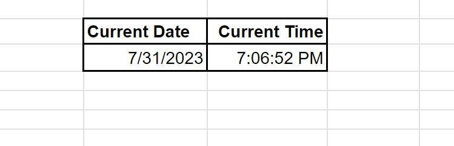

# Current Date and Time in Google Sheets

## Keyboard Shortcuts are the Best

|  | 
|:--:| 
| Image Credits - Photo by <a href="https://unsplash.com/@behy_studio?utm_source=unsplash&utm_medium=referral&utm_content=creditCopyText">Behnam Norouzi</a> on <a href="https://unsplash.com/photos/EVeABQ2Rjf8?utm_source=unsplash&utm_medium=referral&utm_content=creditCopyText">Unsplash</a>|

### Follow these 3 Steps down below to get the current date and time

1. Click on a cell
2. Click `Ctrl ;` for the current date
3. Click `Ctrl Shift ;` for the current time

### Result

